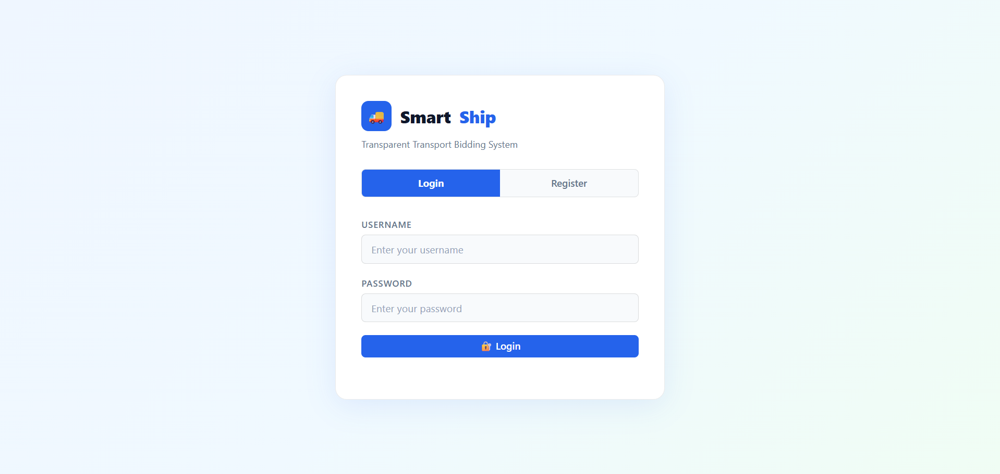
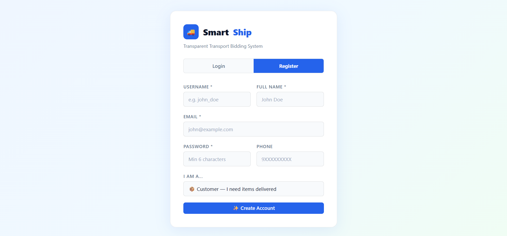
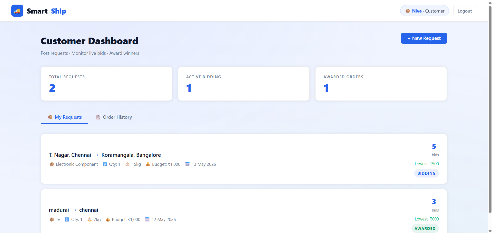
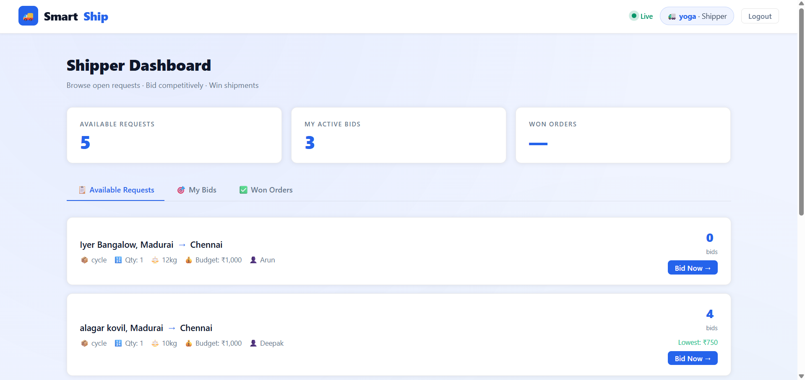
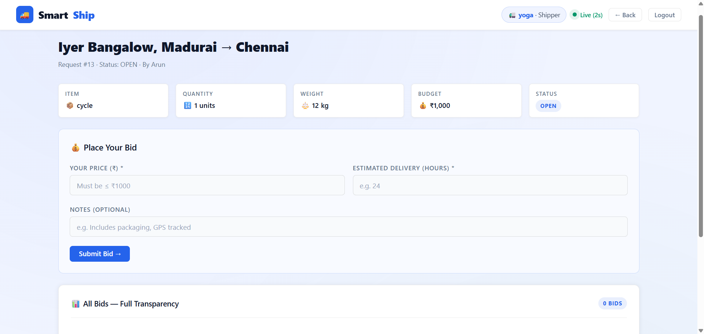
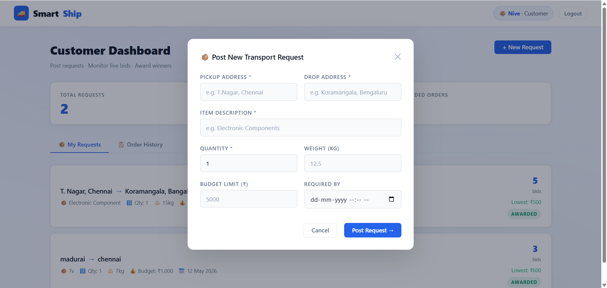
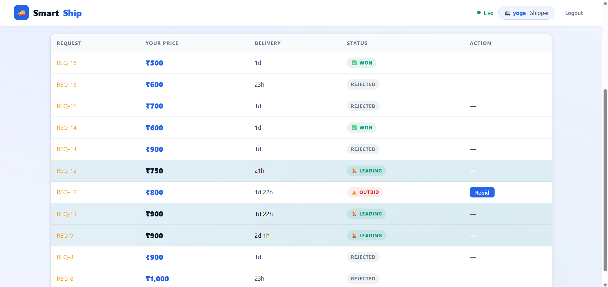
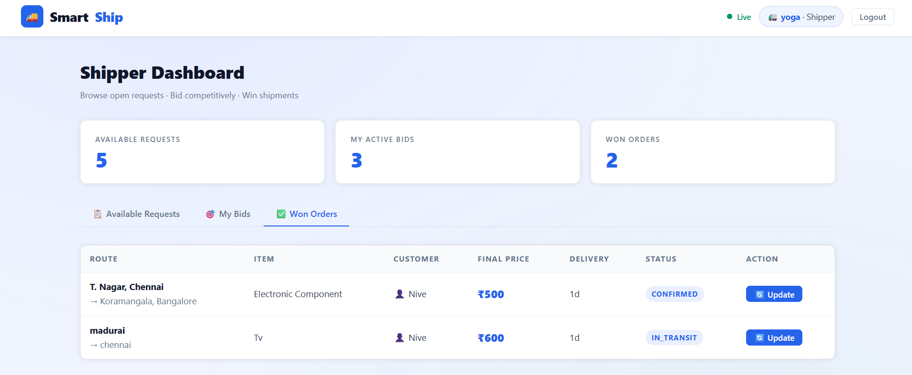
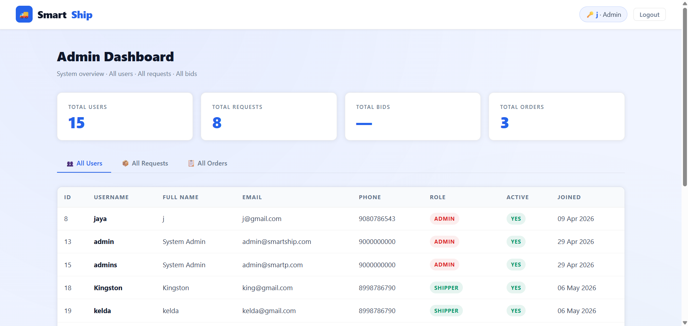

# 🚚 SmartShip — Transparent Transport Bidding System

A full-stack web application that connects **customers** and **shippers** through a **Reverse Auction Bidding System**, ensuring transparent pricing, fair competition, and efficient transport booking.

---

## 📌 Table of Contents

- [Project Overview](#-project-overview)
- [Technology Stack](#-technology-stack)
- [System Architecture](#-system-architecture)
- [Features](#-features)
- [User Roles](#-user-roles)
- [Database Schema](#-database-schema)
- [Project Structure](#-project-structure)
- [Prerequisites](#-prerequisites)
- [Setup Instructions](#-setup-instructions)
- [API Endpoints](#-api-endpoints)
- [Bidding Rules](#-bidding-rules)
- [Sample Credentials](#-sample-credentials)

---

# 📖 Project Overview

SmartShip is a web-based **Transparent Transport Bidding System** where customers post transport requests and multiple transport companies (shippers) compete by placing bids.

Unlike traditional marketplaces, SmartShip follows a **Reverse Auction Model**, where prices decrease as shippers compete for the customer's request.

All bids are visible in real time, enabling customers to make informed decisions based on:

- 💰 Lowest Price
- ⏱ Delivery Time
- 🚛 Transport Provider

Once the customer selects the winning bid, an order is automatically created.

---

# 🛠 Technology Stack

| Layer | Technology |
|--------|------------|
| Backend | Java Spring Boot 3 |
| Database | MySQL 8 |
| Frontend | HTML5, CSS3, JavaScript |
| Authentication | JWT (JSON Web Token) |
| ORM | Spring Data JPA / Hibernate |
| Security | Spring Security + BCrypt |
| Build Tool | Maven |
| Java Version | Java 17 |

---

# 🏗 System Architecture

```text
┌──────────────────────────────────────┐
│          Frontend (Browser)          │
│     HTML + CSS + Vanilla JS          │
│    Polling every 2 seconds           │
└───────────────┬──────────────────────┘
                │
        HTTP REST API Calls
 Authorization : Bearer JWT
                │
┌───────────────▼──────────────────────┐
│        Spring Boot Backend           │
│ Controllers → Services → Repository  │
│ JWT Authentication & Authorization   │
│ Spring Security + Hibernate          │
└───────────────┬──────────────────────┘
                │
           SQL Queries
                │
┌───────────────▼──────────────────────┐
│          MySQL Database              │
│ Users • Requests • Bids • Orders     │
└──────────────────────────────────────┘
```

---

# ✨ Features

- ✅ Secure JWT Authentication
- ✅ Role-Based Authorization
- ✅ Customer Transport Requests
- ✅ Reverse Auction Bidding
- ✅ Real-Time Bid Updates
- ✅ Full Bid Transparency
- ✅ Lowest Bid Highlighting
- ✅ Automatic Outbid Detection
- ✅ Order Creation After Winner Selection
- ✅ Customer Order History
- ✅ Shipper Won Orders
- ✅ Admin Dashboard
- ✅ BCrypt Password Encryption
- ✅ Responsive User Interface

---

# 👥 User Roles

## 📦 Customer

- Register & Login
- Post Transport Requests
- View Live Bids
- Select Winning Bid
- View Order History

---

## 🚛 Shipper

- Register & Login
- View Open Requests
- Place Competitive Bids
- Receive Outbid Alerts
- Rebid to Win
- View Won Orders

---

## 🔑 Admin

- Login
- Manage Users
- View Transport Requests
- Monitor Orders

---

# 🗄 Database Schema

## users

```
id
username
email
password
full_name
phone
role_id
created_at
```

## roles

```
id
name
```

## transport_requests

```
id
customer_id
pickup_address
drop_address
item_description
quantity
weight_kg
budget_limit
status
required_by
created_at
```

## bids

```
id
request_id
shipper_id
price
estimated_delivery_hours
notes
status
created_at
```

## orders

```
id
request_id
winning_bid_id
customer_id
shipper_id
final_price
status
confirmed_at
```

---

# 📁 Project Structure

```text
smartship
│
├── database
│   └── schema.sql
│
├── src
│   ├── main
│   │   ├── java
│   │   │   ├── controller
│   │   │   ├── service
│   │   │   ├── repository
│   │   │   ├── security
│   │   │   ├── config
│   │   │   ├── dto
│   │   │   ├── exception
│   │   │   ├── model
│   │   │   └── SmartShipApplication.java
│   │   │
│   │   └── resources
│   │       ├── static
│   │       └── application.properties
│   │
│   └── test
│
├── pom.xml
└── README.md
```

---

# ⚙ Prerequisites

- Java 17+
- Maven
- MySQL 8+
- IntelliJ IDEA
- Modern Browser

---

# 🚀 Setup Instructions

## 1️⃣ Clone Repository

```bash
git clone https://github.com/yourusername/smartship.git

cd smartship
```

---

## 2️⃣ Create Database

Run

```sql
database/schema.sql
```

using MySQL Workbench or MySQL CLI.

---

## 3️⃣ Configure Database

Update

```
src/main/resources/application.properties
```

```properties
spring.datasource.url=jdbc:mysql://localhost:3306/smartship
spring.datasource.username=root
spring.datasource.password=YOUR_PASSWORD
```

---

## 4️⃣ Run Project

Using IntelliJ:

Run

```
SmartShipApplication.java
```

or

```bash
mvn spring-boot:run
```

---

## 5️⃣ Open Browser

```
http://localhost:8080
```

---

# 🔗 API Endpoints

## Authentication

| Method | Endpoint |
|---------|----------|
| POST | /api/auth/register |
| POST | /api/auth/login |

---

## Transport Requests

| Method | Endpoint |
|---------|----------|
| POST | /api/requests |
| GET | /api/requests |
| GET | /api/requests/{id} |

---

## Bids

| Method | Endpoint |
|---------|----------|
| POST | /api/bids |
| GET | /api/bids/request/{id} |
| GET | /api/bids/my |

---

## Orders

| Method | Endpoint |
|---------|----------|
| POST | /api/orders/select-bid/{bidId} |
| GET | /api/orders/customer |
| GET | /api/orders/shipper |

---

## Admin

| Method | Endpoint |
|---------|----------|
| GET | /api/admin/users |
| GET | /api/admin/requests |
| GET | /api/admin/orders |

---

# 📋 Bidding Rules

- A new bid must be lower than the current lowest bid.
- If the price is equal, delivery time must be faster.
- Higher-priced bids are rejected.
- All bids remain visible to every participant.
- Previous lowest bid becomes **OUTBID** automatically.
- Only the customer who created the request can choose the winner.
- Selecting a winner automatically rejects all remaining bids.
- Bid updates refresh every **2 seconds**.

---

# 🔐 Sample Credentials

| Username | Password | Role |
|----------|----------|------|
| admin | admin123 | Admin |
| john_customer | admin123 | Customer |
| priya_customer | admin123 | Customer |
| swift_ship | admin123 | Shipper |
| speedex | admin123 | Shipper |
| blue_dart_ind | admin123 | Shipper |

---

## 📸 Screenshots


### 🔑 Login Page


---

### 📝 Register Page


---

### 📦 Customer Dashboard


---

### 🚛 Shipper Dashboard


---

### 💰 Live Bidding Page


---

### ➕ Create Transport Request


---

### 📋 Shipper Bidding History


---

### 🏆 Won Orders (Shipper)


---

### 🛠️ Admin Dashboard


# 👨‍💻 Developed By

**Jayapriya-dev**

Backend Developer | Java | Spring Boot | MySQL | REST APIs | Spring Security

---

## ⭐ If you found this project useful, don't forget to Star the repository!